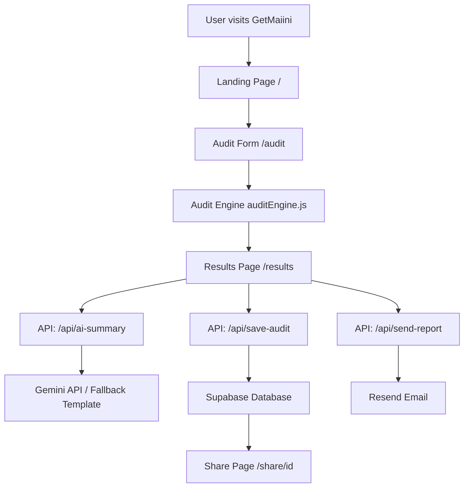

# ARCHITECTURE.md

## System Diagram

## Data Flow

1. User fills the audit form with their AI tools, plans, seats, team size and use case
2. On submit, `auditEngine.js` runs client-side calculations — checking plan fit, seat count vs team size, and tool overlap
3. Results are stored in `localStorage` and user is redirected to `/results`
4. Results page simultaneously calls 3 APIs:
   - `/api/ai-summary` — generates personalized summary via Gemini API (falls back to template)
   - `/api/save-audit` — saves audit to Supabase, returns unique share ID
   - `/api/send-report` — sends email report via Resend when user submits email
5. Share page `/share/[id]` fetches audit from Supabase by ID and renders public version without personal info

## Why This Stack

- **Next.js** — App Router gives file-based routing, API routes, and easy Vercel deployment in one framework. OG tags and server-side rendering for share pages are built in.
- **JavaScript over TypeScript** — Chosen to move faster given the 7-day timeline. Would migrate to TypeScript in production.
- **Tailwind CSS v3** — Utility-first CSS for rapid UI development. v4 had a known native binding bug on Linux so downgraded to v3.4.1.
- **Supabase** — Free tier Postgres with a simple JS client. No backend server needed — API routes talk directly to Supabase.
- **Resend** — Simplest transactional email API. Free tier sufficient for this project.
- **Vercel** — Zero-config deployment for Next.js. Auto-deploys on every push to main.

## Scaling to 10k Audits/Day

- **Database** — Supabase free tier handles ~500MB. At 10k audits/day would need to upgrade to Pro ($25/mo) and add indexes on `id` and `created_at`
- **Email** — Resend free tier allows 3000/month. Would need paid plan at scale
- **AI Summary** — Current fallback template is stateless and scales infinitely. Real Gemini/Anthropic API would need rate limiting and caching
- **Caching** — Share pages could be cached at the CDN level since audit data never changes after creation
- **Rate limiting** — Would add Redis-based rate limiting on API routes to prevent abuse

## Trade-offs Made

1. **Client-side audit logic** — The audit engine runs entirely in the browser. This is fast and scalable but means the logic is visible to users. Acceptable for this use case.
2. **localStorage for state** — Used localStorage to pass audit data between pages instead of a proper state management solution. Simple but breaks if user clears browser storage.
3. **Templated AI summary** — Gemini API free tier quota was exhausted. Fell back to a smart template that uses real audit numbers. Less personalized but always works.
4. **No authentication** — Assignment required no login. Means anyone can generate unlimited audits. Rate limiting on the API routes mitigates abuse.
5. **Tailwind v3 instead of v4** — v4 had a native binding bug on Linux/Codespaces. Downgraded to stable v3.4.1.
